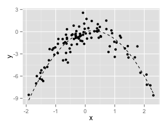
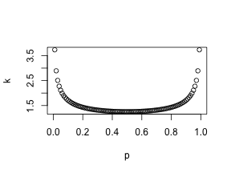
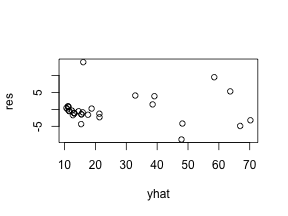
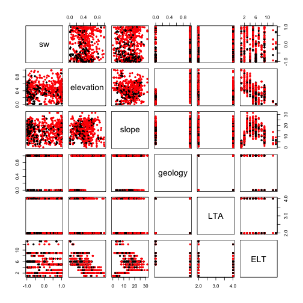

$\blacktriangleright$ \textbf{Exercises 5.8.\quad Solution.} 


```
## Loading required package: methods
```
(a). $n=100$ and $p=2$. The model is
$$
Y_i=X_i-2X_i^2+\varepsilon_i
$$


(b). Obivously, the scatterplot has a quadratic pattern of $x$.

```r
#b
data.xy <- data.frame(x, y)
ggplot(data = data.xy, aes(x = x, y = y)) +
    geom_point() + 
    stat_function(fun = fun.y, linetype = 2)
```



(c).

```r
#c
set.seed(2)
cv.error <- rep(0, 4)
for (i in 1:4){
    glm.fit <- glm(y ~ poly(x,i), data = data.xy)
    cv.error[i] <- cv.glm(data.xy, glm.fit)$delta[1]
}
cv.error
```

```
## [1] 5.890979 1.086596 1.102585 1.114772
```

(d). The results are same because LOOCV does not use any random samping. It evalutes every observation.

```r
#d
set.seed(3)
cv.error2 <- rep(0, 4)
for (i in 1:4){
    glm.fit <- glm(y ~ poly(x,i), data = data.xy)
    cv.error2[i] <- cv.glm(data.xy, glm.fit)$delta[1]
}
cv.error2
```

```
## [1] 5.890979 1.086596 1.102585 1.114772
```

(e). The quadratic model has the smallest LOOCV, which is what we expect since we create the data by using two order polynomial.


(f). It is easily to see that, for all these four models, only intercept, first order term and quadratic term are significatn. It is same to the result of part(e).

```
## [[1]]
##              Estimate Std. Error    t value     Pr(>|t|)
## (Intercept) -1.827707  0.2362206 -7.7372898 9.181461e-12
## poly(x, i)   2.316401  2.3622062  0.9806091 3.292002e-01
## 
## [[2]]
##               Estimate Std. Error   t value     Pr(>|t|)
## (Intercept)  -1.827707  0.1032351 -17.70431 3.804657e-32
## poly(x, i)1   2.316401  1.0323515   2.24381 2.711854e-02
## poly(x, i)2 -21.058587  1.0323515 -20.39866 7.333860e-37
## 
## [[3]]
##                Estimate Std. Error     t value     Pr(>|t|)
## (Intercept)  -1.8277074  0.1037248 -17.6207390 7.610579e-32
## poly(x, i)1   2.3164010  1.0372479   2.2332183 2.785714e-02
## poly(x, i)2 -21.0585869  1.0372479 -20.3023667 1.636959e-36
## poly(x, i)3  -0.3048398  1.0372479  -0.2938929 7.694742e-01
## 
## [[4]]
##                Estimate Std. Error     t value     Pr(>|t|)
## (Intercept)  -1.8277074  0.1041467 -17.5493533 1.444977e-31
## poly(x, i)1   2.3164010  1.0414671   2.2241711 2.850549e-02
## poly(x, i)2 -21.0585869  1.0414671 -20.2201171 3.457023e-36
## poly(x, i)3  -0.3048398  1.0414671  -0.2927023 7.703881e-01
## poly(x, i)4  -0.4926249  1.0414671  -0.4730105 6.372907e-01
```


$\blacktriangleright$ \textbf{Exercises 5.8.\quad Solution.} 


(a). The mean is $\hat{\mu}=22.5328063$.


(b). The standard error of mean is $SE\{\hat{\mu}\}=0.4088611$.


(c).  The standard error of mean using bootstrap is $SE_{bootstrap}\{\hat{\mu}\}=0.4119$, which is very close to the estimate found in (b). of 0.4089.

```
## 
## ORDINARY NONPARAMETRIC BOOTSTRAP
## 
## 
## Call:
## boot(data = medv, statistic = mean.fn, R = 1000)
## 
## 
## Bootstrap Statistics :
##       original        bias    std. error
## t1* 22.5328063  8.517589e-03  0.41193744
## t2*  0.4088611 -8.774353e-05  0.01657105
```


(d). The two confidence intervals are listed as below. They are very close.


```r
ci.t
```

```
## [1] 21.72953 23.33608
```

```r
ci.boot
```

```
## [1] 21.71691 23.33167
```


(e). The estimate of median is $\hat{\mu}_{med}=21.2$.

(f). The estimate standard error of median is 0.3874004, which is smaller than that of mean. Maybe because the estimator of median is a more robust estimator, and the median is a better parameter to describe the center of the population because of the stablity.

```r
#f
median.fn <- function(data, index) 
    return(median(data[index]))
median.boot <- boot(medv, median.fn, R = 1000)
median.boot
```

```
## 
## ORDINARY NONPARAMETRIC BOOTSTRAP
## 
## 
## Call:
## boot(data = medv, statistic = median.fn, R = 1000)
## 
## 
## Bootstrap Statistics :
##     original  bias    std. error
## t1*     21.2 -0.0098   0.3874004
```


```
##   10% 
## 12.75
```
(g). The estimate of tenth percentile is $\hat{\mu}_{0.1}=12.75$.

(h). The estimate standard error of tenth percentile is 0.5113487, which is greater than that of mean. It seems reasonable since tenth percentile contains more information from smaller observations and less infomation from larger observations, while the bootstrap will treat all observations as equally likely to estimate the parameter, which may introduce more variation for estimating the skewed parameter. Remind that the median and the mean summary the information of all observations with equal probability, especially then median. So there is no wonder that the estimate of median has the smallest standard error.


```r
#h
q.10.fn <- function(data, index) 
    return(quantile(data[index], probs = 0.1))
q.10.boot <- boot(medv, q.10.fn, R = 1000)
q.10.boot
```

```
## 
## ORDINARY NONPARAMETRIC BOOTSTRAP
## 
## 
## Call:
## boot(data = medv, statistic = q.10.fn, R = 1000)
## 
## 
## Bootstrap Statistics :
##     original  bias    std. error
## t1*    12.75 0.00515   0.5113487
```

Actually, we know that the stardard error of the estimate of mean is
$$
SE\{\hat{\mu}\}=\frac{s}{\sqrt{n}}
$$
where $s$ is the standard deviation of the sample. And for large sample, the stardard error of the estimate of $p$th percentile is
$$
SE\{\hat{\mu}_{p}\}=\frac{s\sqrt{p(1-p)}}{\sqrt{n}\phi(\Phi^{-1}(p))}=SE\{\hat{\mu}\}\frac{\sqrt{p(1-p)}}{\phi(\Phi^{-1}(p))}
$$
where $\phi$ is the pdf of normal distribution and $\Phi^{-1}$ is the quantile function of normal distribution. So there is a ratio between the stardard error of the estimate of mean and that of $p$th percentile. The ratio has a smallest value at $p=0.5$, which means the median. When going to each boundary, this ratio becomes very large, which implies the high variance of tenth percentile. The plot of the ratio is like this:



$\blacktriangleright$ \textbf{Problem 3.\quad Solution.} 

For this linear regression problem, if we only consider the three predictors and the interactions among them (because when we want to try any other forms of predictor, it means we also need to estimate the form of model, which would be better by nonparametric method), the total number of all possible models will be $2^{2^3-1}-1=127$.
So it is possible for us to use exhaustive enumeration method to compare all models to select the "best" model based on CV. 


```
## 
## Attaching package: 'car'
## 
## The following object is masked from 'package:boot':
## 
##     logit
```

```r
regressor <- c(names(pages)[3], 
               names(pages)[4], 
               names(pages)[5], 
               paste(names(pages)[3], 
                     names(pages)[4], 
                     sep = "*"), 
               paste(names(pages)[3], 
                     names(pages)[5], 
                     sep = "*"), 
               paste(names(pages)[4], 
                     names(pages)[5], 
                     sep = "*"), 
               paste(names(pages)[3], 
                     names(pages)[4], 
                     names(pages)[5],
                     sep = "*"))
indices <- expand.grid(c(TRUE, FALSE), 
                       c(TRUE, FALSE), 
                       c(TRUE, FALSE),
                       c(TRUE, FALSE), 
                       c(TRUE, FALSE),
                       c(TRUE, FALSE),
                       c(TRUE, FALSE)
                       )
cvError <- rep(NA, 127)
for (n in 1:127){
    lmformula <- reformulate(regressor[as.logical(indices[n, ])], 
                             response = "pages")
    glm.fit <- glm(lmformula, data = pages)
    cvError[n] <- cv.glm(data = pages, 
                         glmfit = glm.fit, 
                         K = 5)$delta[2]
    names(cvError)[n] <- paste(regressor[as.logical(indices[n, ])], 
                               collapse = "+")
}
best <- cvError[which.min(cvError)]
best.lm <- lm(as.formula(paste("pages", names(best), sep = "~")), 
              data = pages)
res <- resid(best.lm)
yhat <- predict(best.lm)
plot(yhat, res)
```



```r
outlierTest(best.lm)
```

```
##   rstudent unadjusted p-value Bonferonni p
## 7 3.870018         0.00077646      0.02407
```

After running the code, we can get the best mode is \text{"pages~cl+cl*il+cl*ld+il*ld"} with the CV=31.4730839. Since we have 127 models, which too many to display, so I only show the best 5 model and the worst 5 model.

```r
options(width = 60)
cvError.sorted <- sort(cvError)
head(cvError.sorted, n = 5)
```

```
##    cl+cl*il+cl*ld+il*ld                   il+ld 
##                31.47308                40.31026 
## il+ld+cl*il+cl*ld+il*ld             il+ld+il*ld 
##                41.24556                43.81768 
##                   il*ld 
##                44.96505
```

```r
tail(cvError.sorted, n = 5)
```

```
##                ld+cl*il*ld       il+ld+cl*ld+cl*il*ld 
##                   246.3207                   312.7655 
##          il+cl*ld+cl*il*ld    ld+cl*il+cl*ld+cl*il*ld 
##                   395.6746                  1990.7422 
## cl+il+cl*il+cl*ld+cl*il*ld 
##                  2513.6995
```

The residual plot seems not so bad, only one outlier--data of 10/7. But the data point is too concentrated, which may make some data with large $y$ get higt leverage. The P-value of Shapiro-Wilk test is $9.8363993 &times; 10<sup>-4</sup>$, which implies that the residuals is not normal in fact. So the assumption of regression is not valid, then the model is not appropriate. This also explain why the model select procedure is not stable, from which the "best" model will change by using different random seed, because we chose a wrong form of model.


$\blacktriangleright$ \textbf{Problem 4.\quad Solution.} 

It is very similar to problem 3., the main difference is the cost funtion. The cost function for a classification problem is usually the error rate of prediction. So the best model is the model which has smallest error rate.

```r
#4
set.seed(1)
des <- read.table(file = "./des_site1and2sp_2.dat", 
                  col.names = c("glu", 
                                "nud", 
                                "utmn", 
                                "utme", 
                                "sw", 
                                "elevation", 
                                "slope", 
                                "geology", 
                                "LTA", 
                                "ELT", 
                                "site", 
                                "subplot"))
attach(des)
glu <- as.factor(glu)
geology <- as.factor(geology)
LTA <- as.factor(LTA)
ELT <- as.factor(ELT)
site <- as.factor(site)
costFunction <- function(y, yhat) return(mean(y != (yhat > 0.5)))
cvError.inter <- rep(NA, 15)
cvError.noint <- rep(NA, 15)
n <- 1
for (i in 5:9){
    for (j in (i+1):10){
        glmformula.inter <- as.formula(
            paste("glu~(", 
                  paste(names(des)[c(i, j)], 
                        collapse = "+"), 
                  ")^2"
            )
        )
        glmformula.noint <- as.formula(
            paste("glu~", 
                  paste(names(des)[c(i, j)], 
                        collapse = "+")
            )
        )
        logis.fit.inter <- glm(glmformula.inter,
                               family = "binomial", 
                               data = des)
        logis.fit.noint <- glm(glmformula.noint,
                               family = "binomial", 
                               data = des)
        cvError.inter[n] <- cv.glm(data = des, 
                                   glmfit = logis.fit.inter, 
                                   cost = costFunction, 
                                   K = 10)$delta[1]
        cvError.noint[n] <- cv.glm(data = des, 
                                   glmfit = logis.fit.noint, 
                                   cost = costFunction, 
                                   K = 10)$delta[1]
        names(cvError.inter)[n] <- paste(
            as.character(glmformula.inter)[2],
            as.character(glmformula.inter)[1],
            as.character(glmformula.inter)[3],
            collapse = " ")
        names(cvError.noint)[n] <- paste(
            as.character(glmformula.noint)[2],
            as.character(glmformula.noint)[1],
            as.character(glmformula.noint)[3],
            collapse = " ")
        n <- n + 1
    }
}
best.inter <- min(cvError.inter)
best.noint <- min(cvError.noint)
names(best.inter) <- names(cvError.inter)[which.min(cvError.inter)]
names(best.noint) <- names(cvError.noint)[which.min(cvError.inter)]
```
For 15 models with no interaction, the CVs are

```r
best.noint
```

```
## glu ~ slope + geology 
##             0.2416107
```
So the best model is "$glu ~ slope + geology$", with CV=0.2416107.

Similarly, For 15 models with interaction, the CVs are

```r
best.inter
```

```
## glu ~ (slope + geology)^2 
##                 0.2432886
```
So the best model is "$glu ~ (slope + geology)^2$", with CV=0.2432886.

To be noticed, if we run the code using another seed, the result will change. So according to the experience of problem 3, maybe the form of model is wrong or the predictors are not correlated with the response. I will check the scatterplot matrix,

```r
pairs(des[c(5:10)], col = c("red", "black")[glu], pch = 20)
```

 

From the plot, the variable "geology", "sw" and "slope" seems to be kind of good predictor. And there is no perfect linear classifier for "geology" and "LTA" combination, since this is a exclusive-or problem. But it is really hard to see any apparent boundary. So I still try every linear predictor. 

```r
regressor <- names(des[5:10])
indices <- expand.grid(c(TRUE, FALSE), 
                       c(TRUE, FALSE), 
                       c(TRUE, FALSE),
                       c(TRUE, FALSE), 
                       c(TRUE, FALSE),
                       c(TRUE, FALSE)
                       )
cvError.lin <- rep(NA, 63)
for (n in 1:63){
    lmformula <- reformulate(regressor[as.logical(indices[n, ])], 
                             response = "glu")
    glm.fit <- glm(lmformula, data = des)
    cvError.lin[n] <- cv.glm(data = des, 
                         glmfit = glm.fit, 
                         K = 10)$delta[2]
    names(cvError.lin)[n] <- 
        paste(regressor[as.logical(indices[n, ])], collapse = "+")
}
best.lin <- min(cvError.lin)
names(best.lin) <- names(cvError.lin)[which.min(cvError.lin)]
```
So the best linear classifier is "$glu~sw+elevation+slope+LTA$", with CV=0.1658706.

Then, I want know how the model with these four variable and all interactions among them,

```r
glm.fit <- glm(glu~(sw+elevation+slope+LTA)^2, data = des)
cvError.4.inter <- cv.glm(data = des, 
                         glmfit = glm.fit, 
                         K = 10)$delta[2]
cvError.4.inter
```

```
## [1] 0.1666025
```
The CV is $0.1666025$, which is larger than the CV of the linear classifier. Thus, the interactions among these four variable are not necessary.

Next, I want to consider the interaction of the two variable not in the model.

```r
glm.fit <- glm(glu~sw+elevation+slope+LTA+geology*ELT, data = des)
cvError.6.inter <- cv.glm(data = des, 
                         glmfit = glm.fit, 
                         K = 10)$delta[2]
cvError.6.inter
```

```
## [1] 0.168521
```
The CV is $0.168521$, which is also larger than the CV of the linear classifier. Thus, this interactions among these four variable are not necessary.

Then, I try some other interactions. For example, interactions between one of the predictors in linear classifier and one of the predictors not in linear classifier,

```r
glm.fit <- glm(glu~sw+elevation+slope+LTA+sw*ELT, data = des)
cvError.1 <- cv.glm(data = des, 
                         glmfit = glm.fit, 
                         K = 10)$delta[2]
cvError.1
```

```
## [1] 0.1664593
```

```r
glm.fit <- glm(glu~sw+elevation+slope+LTA+elevation*ELT, data = des)
cvError.2 <- cv.glm(data = des, 
                         glmfit = glm.fit, 
                         K = 10)$delta[2]
cvError.2
```

```
## [1] 0.1679606
```

```r
glm.fit <- glm(glu~sw+elevation+slope+LTA+slope*ELT, data = des)
cvError.3 <- cv.glm(data = des, 
                         glmfit = glm.fit, 
                         K = 10)$delta[2]
cvError.3
```

```
## [1] 0.1670835
```

```r
glm.fit <- glm(glu~sw+elevation+slope+LTA+LTA*ELT, data = des)
cvError.4 <- cv.glm(data = des, 
                         glmfit = glm.fit, 
                         K = 10)$delta[2]
cvError.4
```

```
## [1] 0.1678978
```
The result does not improved significantly. So the linear classifier with four predictor, $sw,~elevation,~slope,~LTA$, is good enough for this dataset. Compared to the two variable model, this classifier reduces the error rate from 24.16% to 16.58%, about one third improvement.


